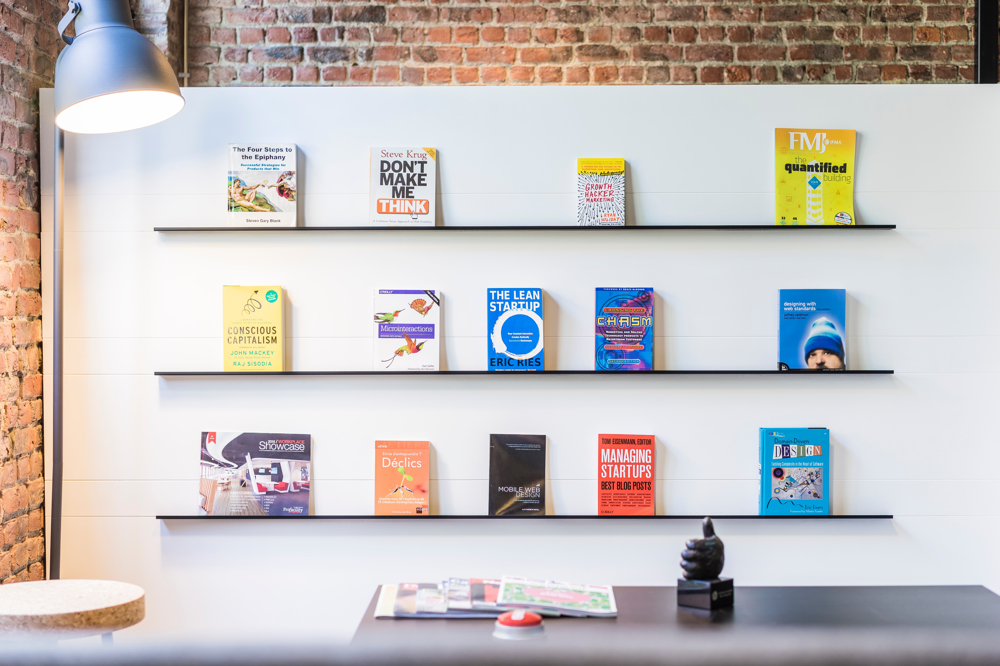

Pedimos ao João, da nossa equipa, para organizar uma pequena lista com os livros que mais recomenda, neste momento, para todos aqueles com pequenos negócios que querem aprender mais ou aqueles que querem alavancar a sua ideia!

Segue, então, o seu testemunho e a lista dos livros que mais o impactaram quando estava a começar o seu caminho com o <a href="https://menoshub.com/" target="_blank">menos</a>, de apoio aos micro e pequenos negócios:

#### <a href="https://www.wook.pt/livro/startup-chris-guillebeau/14953567" target="_blank">1- A Startup de 100$ | Chris Guillebeau</a>

Foi, provavelmente, dos primeiros livros que li relacionados com empreendedorismo e gostei particularmente de duas abordagens que encerra em si.

a.  Começar com muito pouco (como o próprio nome indica) e ir escalando a partir daí – cada vez faz mais sentido para mim esta abordagem. Passamos o dia a ouvir falar de sucessos megalómanos de start-ups que recebem muitos milhões de financiamento e parece-nos que a única maneira de criarmos o nosso negócio é essa, quando não é verdade. Começarmos com pouco, apesar de demorar mais tempo, reduz brutalmente o risco e isso, na maior parte das vezes é o mais critico. Essa metodologia está embrenhada no Menos e trabalhamos com os nossos empreendedores sempre dessa forma. 

b.  Transformarmos algo que realmente gostamos no nosso negócio – criar um negócio é um caminho doloroso e solitário e parece-me que, cada vez mais, só se tivermos a fazer algo que naturalmente gostamos vale a pena.

Portanto, de uma forma accionável e sempre recheado de exemplos, este livro mostra como caminhar os primeiros passos para lançarmos um negócio que nos preencha pessoalmente e que nos possa sustentar profissionalmente.

#### <a href="https://www.bertrand.pt/livro/lean-startup-eric-ries/14780796" target="_blank">2- Lean Start-up, Eric Ries</a>

Apesar de atualmente o conceito de lean start-up já estar normalizado, acho que o livro do Eric Ries continua a ser uma bíblia para quem quer dar os primeiros passos. É um pouco mais técnico mas está recheado de aprendizagens altamente valiosas. A grande lição que tirei é que hoje é possível lançar um produto para o mercado antes de termos um produto. Isto revolucionou a forma como lançamos negócios, quanto investimos e como pensamos em vender.

Também desmistifica a ideia de que os grandes produtos e empresas eram perfeitos quando foram lançados e por isso é que cresceram tanto. Isso é mentira. Os grandes negócios foram os que conseguiram aprender e reinventar-se mais rápido e por isso é que se tornaram grandes ideias.

O Lean Startup foca-se em tecnologia mas acredito que é fácil fazer uma transposição para quase todas as outras indústrias e até para negócios convencionais como cabeleireiros, restaurantes, entre outros. 

#### <a href="https://www.fnac.pt/The-Hard-Thing-About-Hard-Things-Ben-Horowitz/a1176046" target="_blank">3- The Hard Things about Hard Things, Ben Horowitz</a>

Recomendo este livro a qualquer pessoa que está a começar, não só um negócio, mas qualquer iniciativa. É um livro brutal, no sentido mais literal da palavra e acredito que se depois de o lermos com atenção, continuarmos motivados a lançar o nosso negócio, é bom sinal.

Quase todos os livros que li sobre o assunto romantizam o empreendedorismo e o lançar um negócio, este faz um retrato nu e cru do processo que tem muito pouco de romântico. É uma visão a uma escala megalómana, mas as lições, mais ou menos acentuadas, são semelhantes. É quase doloroso ler o livro, mas está cheio de aprendizagens valiosas. 

Livros há muitos, estes são as sugestões de um dos membros da nossa equipa e, em breve, voltaremos com novas recomendações específicas para pequenos negócios. Fiquem atentos!

